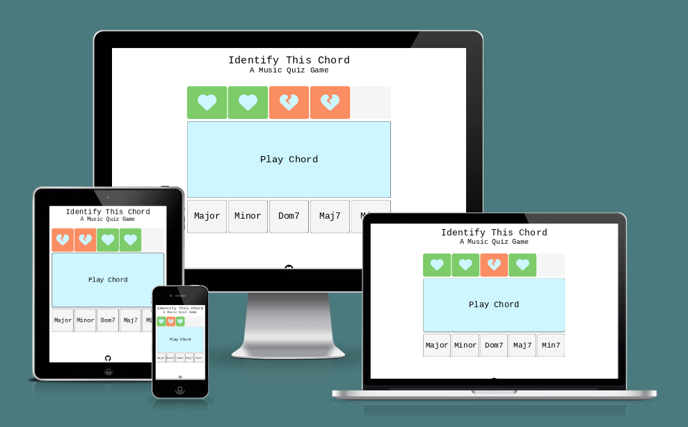
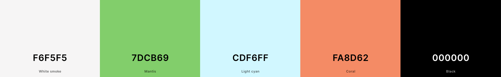
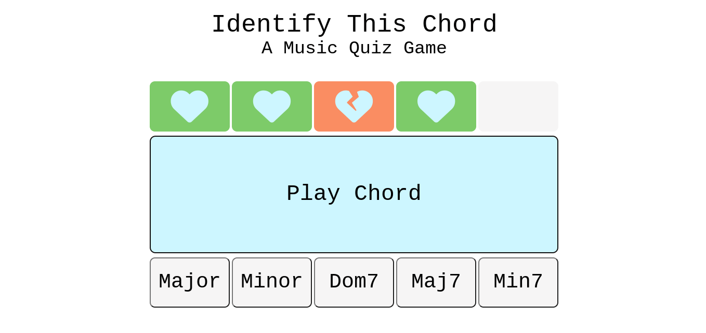
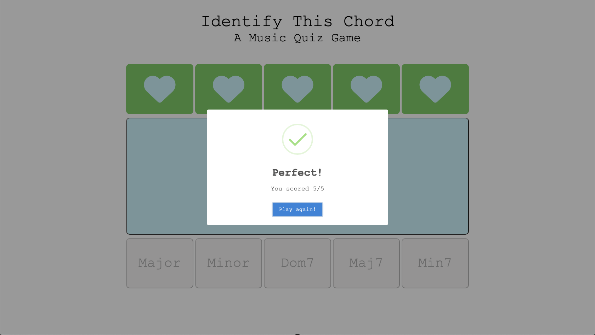
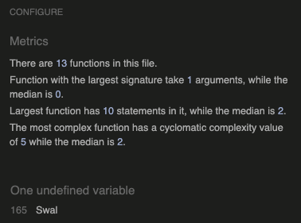
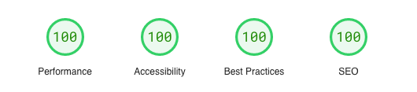
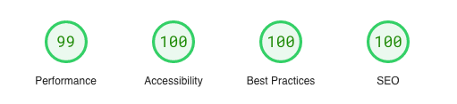
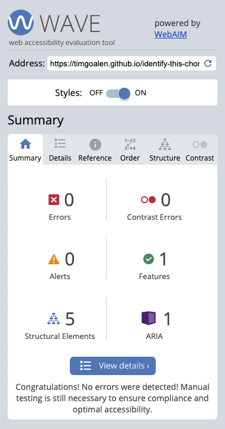
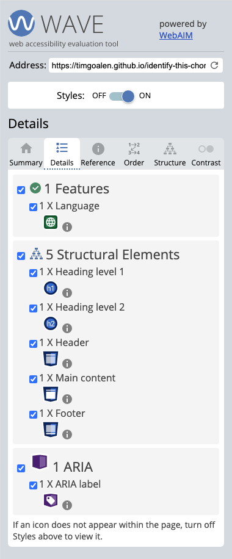

# Identify This Chord - A Music Quiz Game

[View the live project here](https://timgoalen.github.io/identify-this-chord/)



**Identify This Chord** is a quiz game intended to help users recognise five of the most commonly used chord types.

It presents the chord in a randomised order and works as a learning tool, as it allows the user to keep playing until they score a perfect 5/5.

## Design
The design is simple and balanced. The five chord type buttons are mirrored by the five score squares above. 

The gameplay was led by the design, in the way five rounds was chosen for the game length - enabling the five results squares to mirror the five answer squares. A more balanced design than a game length of four or eight rounds for example.

The site was designed with a mobile-first approach, using `min-width` media queries to adjust the layout for larger screens.

### Colour Scheme
The colour scheme was chosen by a combination of adjusting the colour picker within Chrome Dev Tools, and using [Coolers](https://coolers.co/) for comparing colours side by side and fine tuning shades.

The pale blue ‘Play Chord’ button stands out against the monochromatic background and acts as a call to action, making it clear how the user is expected to start the game.

The score area uses red and green colours to indicate the players current score and game progress. The toned down shades were chosen instead of a bright red and green, to be more harmonious with the rest of the scheme.



### Typography
A single font - 'Courier New’ - was chosen for the site. As web-safe font, it doesn't rely on importing external fonts (Google Fonts etc.), which would result in a slight reduction in performance.

## Features

### Home Page

The site consists of a single home page, with title and sub-title at the top; It includes - 

Score Area: which shows the users progress by a series of five squares turning red (for a wrong answer) or green (for a correct answer). Heart or broken heart icons appear to make the purposes of these score squares even clearer.

Play Chord button: a large central button which draws the users attention to where they should make their first interaction with the site.

Answer buttons: on pressing the Play Chord button, the answer buttons below are enabled, allowing the user to choose from five possible answers.

### Footer

The footer consists of a single logo to take the user to the developer’s GitHub profile.

### Game Over Popup


[SweetAlert2](https://sweetalert2.github.io/) is used to display the score at the end of the game. It includes a customised message (depending on the users score) and a "Play Again!" button. The customised messages are:

Score of 5 = "Perfect!"

Score of 4 = "Excellent!"

Score of 3 = "Well done!!"

Score of 2 = "Nice try!"

Score of 1 = "Unlucky!"

## Future Implementations
- An additional page, or popup modal, that helps the user by describing how to identify each chord (by feeling/mood), and has a single-note arpeggio recording of the chords to better hear each note separately.
- Additional, harder levels could be added once the user has reached a perfect 5/5 score. Either with more complex chords or with different instrumentation.

## Technologies Used

- Languages Used:
    - [JavaScript](https://en.wikipedia.org/wiki/JavaScript)
    - [HTML](https://en.wikipedia.org/wiki/HTML5)
    - [CSS](https://en.wikipedia.org/wiki/Cascading_Style_Sheets)
- [Visual Studio Code](https://code.visualstudio.com/) - as the code editor.
- [Git](https://git-scm.com/) - for version control, using the Gitpod IDE.
- [GitHub](https://github.com/) - for storing the project.
- [Chrome Developer Tools](https://developer.chrome.com/docs/devtools/) - to troubleshoot code.
- [Font Awesome](https://fontawesome.com/) - for the GitHub icon in the footer and the heart icons in the score area.
- [SweetAlert2](https://sweetalert2.github.io/) - for the popup on game completion.
- [Coolers](https://coolers.co/) - for an overview of the chosen colour palette.
- [Favicon.io](https://favicon.io/) - to create the favicons.
- [TinyPNG](https://tinypng.com/) - to compress the Readme images.
- [Am I Responsive](https://ui.dev/amiresponsive) - to create the responsive demo image at the top of the Readme.
- [PageSpeed Insights](https://pagespeed.web.dev/) - for automated testing of performance, accessibility, best practices and SEO.
- [WebAIM WAVE](https://wave.webaim.org/) - for automated testing of accessibility.
- [Eightshapes Contrast Grid](https://contrast-grid.eightshapes.com/) - to visualise the contrast accessibility of the whole site colour palette. 
- [JSHint](https://jshint.com/) - to test the JavaScript code.
- [W3C Markup Validator](https://validator.w3.org) - to test the HTML code.
- [W3C CSS Validator](https://jigsaw.w3.org/css-validator) - to test the CSS code.


## Testing

Javascript was tested with [JSHint](https://jshint.com/). No errors were found in the published version of the site:



*The undefined variable 'Swal' is from the SweetAlert2 code.

On the initial JSHint testing, this warning was found, relating to the `for` loop that creates the event listeners for the answer buttons:

"Functions declared within loops referencing an outer scoped variable may lead to confusing semantics. (submittedAnswer, answerButton, submitAnswer)"

This was the original code: 
```
// Retrieves user answer
for (let answerButton of answerButtons) {
    answerButton.addEventListener("click", function () {
        submittedAnswer = answerButton.dataset.id;
        submitAnswer();
    })
}
```
The error was corrected by changing the `for` loop to a `forEach` loop, as shown below, which first uses the `Array.from()` method to create an iterable array from the HTML collection `answerButtons`.
```
// Retrieves user answer
Array.from(answerButtons).forEach(answerButton => {
    answerButton.addEventListener("click", function () {
        submittedAnswer = answerButton.dataset.id;
        submitAnswer();
    });
});
```

HTML and CSS were tested with [W3C Markup Validator](https://validator.w3.org) and [W3C CSS Validator](https://jigsaw.w3.org/css-validator). No errors were found.

### PageSpeed Insights

The [PageSpeed Insights](https://pagespeed.web.dev/) results for the published site are - 

#### Desktop:


#### Mobile:


### WebAIM WAVE
Site accessibility was checked with [WebAIM WAVE](https://wave.webaim.org/). There are no errors on the published site.

<details><summary>WebAIM WAVE summary</summary>

</details>
<details><summary>WebAIM WAVE details</summary>

</details>

### Devices & Browsers Used for Manual Testing
- iPhone SE (2020)
    - Safari (v16.1)
    - Chrome (v112)
- iPad (6th Generation)
    - Chrome (v111)
    - Safari (v15)
- Mac Pro (Mid 2012)
    - Chrome (v112)
    - Safari (v12.1.2)
    - Firefox (v112.0)
- Dell Chromebook 3120
    - Chrome (v103)

### Manual Testing of User Actions
| Feature | Action | Expected Behaviour | Pass/fail |
|---|---|---|---|
| "Play Chord" Button | Click on button | Plays audio file & enables answer buttons| PASS |
| "Play Chord" Button | Click on button again before submitting answer | Replays audio file | PASS |
| Answer Buttons | Click on "Major" button | Submits answer, updates score block and disables answer buttons | PASS |
| Answer Buttons | Click on "Minor" button | Submits answer, updates score block and disables answer buttons | PASS |
| Answer Buttons | Click on "Dom7" button | Submits answer, updates score block and disables answer buttons | PASS |
| Answer Buttons | Click on "Maj7" button | Submits answer, updates score block and disables answer buttons | PASS |
| Answer Buttons | Click on "Min7" button | Submits answer, updates score block and disables answer buttons | PASS |
| Answer Buttons | Click on any answer button when on the fifth "question" | Submits answer, updates score block, disables answer buttons and launches SweetAlert2 popup | PASS |
| Game Over popup | User submits an answer in the fifth round of play | SweetAlert is displayed, with a custom message depending on final score | PASS |
| Game Over popup | Click on the "Play Again!" button | Reloads the game | PASS |
| Game Over popup | Click anywhere on the screen | Reloads the game | PASS |
| Footer | Click on Github logo | Opens the developer's GitHub profile in a new tab | PASS |

### Fixed Bugs
| Bug | Fix |
|---|---|
| After a game, when the user dismissed the SweetAlert by clicking elsewhere on the page (not on the "Play Again!" button), the site wouldn't accept further input and would essentially freeze. | Changing the SweetAlert2 code that triggers the `startGame()` function from `result.isConfirmed` to just `result` causes the game to restart if the user chooses to by clicking the "Play Again!" button and *also* if they click anywhere else on the screen. |

### Known Bugs

- Currently, when an audio object is played, it plays simultaneously with any previously playing audio. The functionality could be changed in the future if desired, so that "Play Chord" button would change the `audio.src`, rather than creating a new audio object. This code could be used which would result on no overlapping audio (an additional method for crossfading from the previously playing audio would be needed to glitches on the transition): 
```
let audio = new Audio();

function playAudio() {
    enableAnswerButtons();
    audio.src = randomAudioArray[audioIndex].question;
    audio.play();
}
```
- Font sizes will appear small on old versions of Safari (pre-2020) that don't support `clamp()` font sizes in CSS. According to [Can I Use](https://caniuse.com/) it only accounts for 0.07% of global browser usage, so bug was left unfixed.
- SweetAlert2 popups didn't function correctly on an old Safari browser (v12 from 2019) used for testing.  

## Deployment

### GitHub Pages

The project was deployed to GitHub Pages using the following steps...

Note: Any code committed to the "main" branch will automatically update the live site.
1. Log in to GitHub and locate the [GitHub Repository](https://github.com/timgoalen/identify-this-chord)
2. At the top of the Repository (not top of page), locate the "Settings" Button on the menu.
3. In the left sidebar, click on "Pages" in the "Code and automation" section.
4. Under "Source", click on the dropdown menu and choose "Deploy from a branch".
5. Under "Branch", from the "Select a branch" dropdown menu choose "main"; and from the "Select a folder" dropdown menu choose "/ (root)"; then click the "Save" button in the "Branch" section.
6. Locate the now published site at the top of the "GitHub Pages" page.

### Forking the GitHub Repository

By forking the GitHub Repository we make a copy of the original repository on our GitHub account to view and/or make changes without affecting the original repository by using the following steps...

1. Log in to GitHub and locate the [GitHub Repository](https://github.com/timgoalen/identify-this-chord)
2. At the top right of the Repository, just below the GitHub navbar, click on the "Fork" Button.
3. You should now have a copy of the original repository in your GitHub account.

### Making a Local Clone

1. Log in to GitHub and locate the [GitHub Repository](https://github.com/timgoalen/identify-this-chord)
2. Above the list of files, click "Code".
3. To clone the repository using HTTPS, under "Clone with HTTPS", copy the link.
4. Open Git Bash
5. Change the current working directory to the location where you want the cloned directory to be made.
6. Type `git clone`, and then paste the URL you copied in Step 3.

```
$ git clone https://github.com/YOUR-USERNAME/YOUR-REPOSITORY
```

7. Press Enter. Your local clone will be created.

```
$ git clone https://github.com/YOUR-USERNAME/YOUR-REPOSITORY
> Cloning into `CI-Clone`...
> remote: Counting objects: 10, done.
> remote: Compressing objects: 100% (8/8), done.
> remove: Total 10 (delta 1), reused 10 (delta 1)
> Unpacking objects: 100% (10/10), done.
```

Click [Here](https://help.github.com/en/github/creating-cloning-and-archiving-repositories/cloning-a-repository#cloning-a-repository-to-github-desktop) to retrieve pictures for some of the buttons and more detailed explanations of the above process.

8. For changes you've made to reflect on the live site:

    -   Type `git add <files changed> `
    -   Type `git commit -m <description of change> `
    -   Type `git push`

## Credits

### Code
- The inspiration for the selectAudioForGame() function:

    - The defineQuestions() function from: https://github.com/tanisecarvalho/horns-on-fire/blob/main/assets/js/script.js

- The inspiration for creating new audio objects from an array:
    - https://palettes.shecodes.io/athena/26906-how-to-play-a-random-audio-from-an-array-in-javascript

### Media

- All audio content created by the developer.

### Acknowledgements

- My mentor Brian Macharia for his invaluable guidance.